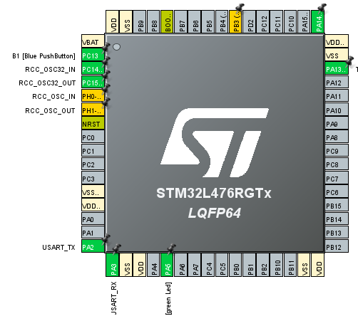

# Vaja 6 – Več kanalna (scan mode) ADC pretvorba z Nucleo-L476RG

## Cilj naloge

S pomočjo programskega okolja STM32CubeIDE in HAL knjižnicami sprogramirajte mikroprocesor tako, da bo izvajal ADC pretvorbe na več kanalnih sočasno v scan mode način. Vrednosti treh zunanjih potenciometrov boste zajemali preko Nuclea-L476RG in jih prikazovali na STM Studio.

## Postopek inicializacije periferije

- pini za vhode so **PC0** , **PC1** , **PC2**.  
- Poleg pinov se izpiše **ADC1_IN1,2,3**.  
- Izbrana Vrednost parametra je **4**.  
- Privzeta vrednost *Number of Conversio* je **1**.  
- **tvz** = 61,87μs 
- **DMA** = Direct memory access (Direkten dostop spomina).
  

## Pinout

## Slika Vezja

## Komentar
- Sampling Time je 247,5 sej je najblizje 239,5.
- Koda ne delje. Nimam niti malo pojma zakaj. Vrednost pri vseh treh vrednostih je enaka.